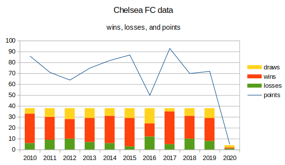

# D3JS Assesment plan

To complete this assesment, I will create a graph that displays the data from the file.
The graph will look something like this:

There will be different axes for the different scales; I will have the number of games, wins and losses on the left and the number of points on the right.

I will also create tests to measure and confirm my progress with selenium.

I will also create a second version that incorporates more information from associated teams.